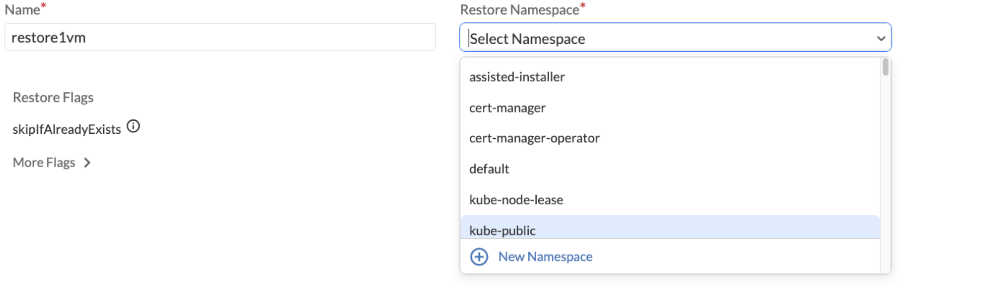
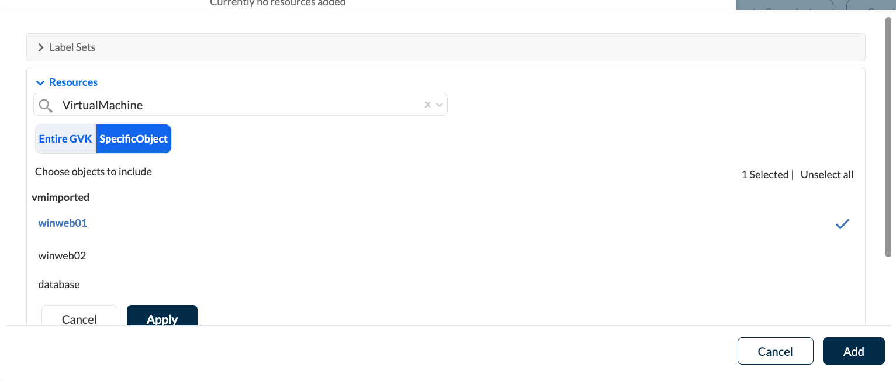

= Restoring a Backup from the Trilio UI

== Introduction

In this section we will restore just one of the virtual machines using the Trilio UI and we will modify some of its configuration using the *Transfrom* functionality.

== Create the Restore

Go to the Trilio UI from the Trilio Backups section in the Red Hat OpenShift console and log on using the OpenShift credentials (*admin*).

* On the left menu, click on *Backup & Recovery* and then *Backup Plans* button.

image::../assets/images/backup-plans.io[]

* Choose the *Restore* option for *backup-1*

* For *Name* enter *restore-1vm*. We will create a new namespace to restore to, so select *New Namespace* and call it *singlevm-restore*. Once created click on *Next*.

* Now we will specify the virtual machine that we want to restore. Click on *Add Resources*, expand the *Resources* tab and select *Virtual Machine*

* Click on the *SpecificObject* tab, select the *winweb01* virtual machine and click on *Apply*, then *Add* and then *Next*.

* Now we will modify some of the features of the virtual machine to be restored, namely the number of cores, its memory and its OS image. Click on *Add Transform Components*, and choose *Virtual Machine*.

* Since we are going to apply the transform to *winweb01* only, we can delete the other two virtual machines from the list. Type *modify-resources-and-vmtype* in the *Transform Name* field.

* Type *core* in the *Path* field and select that suggested path. Give the value *2*.

* We can click on *Preview Changes* to see the differences that the transform will introduce in the YAML file for the virtual machine.

* In order to specify the amount of memory for the restored virtual machine, click on *Add Another*, type *memory* in the *Path* field, accept the suggested path and type *"4Gi"* in the *Value* field.

image::../assets/images/memory.png[]

* Let's now specify the OS image by clicking again on *Add Another* and typing *machine* in the *Path* field. Type *"pc-q35-rhel9.20"* in the *Value* field and click on *Apply*

* Click on *Add* and then on *Create*.

* Confirm by clicking on *Create Restore* and the restore will be triggered.

As we saw in the previous section, the restore takes around 10 minutes to complete and the status will be shown as it progresses. Once it is completed we will see this:

== Validating the Restore
When the restore is complete, we will check that the virtual machine has been created in the new namespace with the resources that we specified.

* Go back to the Red Hat OpenShift console, select the *singlevm-restore* namespace and click on *Virtualization -> VirtualMachines*.

Notice that the only virtual machine that has been restored is *winweb01*. Click on it and in the *Overview* tab we will see that it has *2* cores and *4GiB* of memory.

You have successfully restored a single virtual machine with different features from the original to a new namespace  using Trilio UI.
